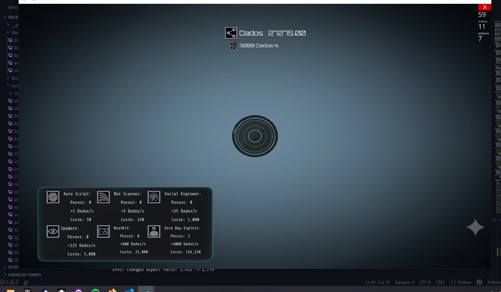
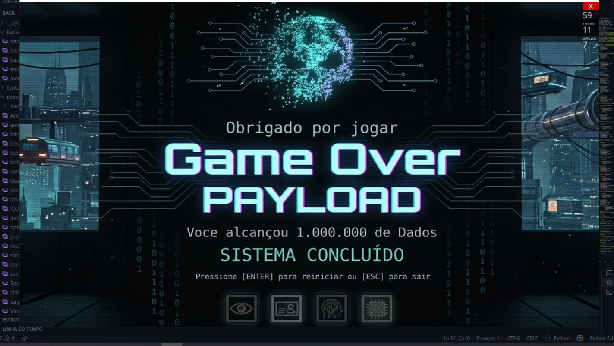

# Payload: Cyber Clicker Game 💻

Bem-vindo ao **Payload**, um jogo estilo *clicker* com temática hacker!

## 🚀 Como jogar
1. Clone este repositório.
2. Instale as dependências: `pip install -r requirements.txt`
3. Execute: `python main.py`

## 📸 Screenshots

Um jogo incremental cyberpunk feito em Python com Ursina Engine.

## 🎮 Sobre o jogo

Game Over: Payload é um clicker incremental onde o jogador gera **Dados** através de cliques manuais e sistemas automáticos de hacking.

Você começa com um simples botão de hack e evolui até montar uma infraestrutura completa de ataque digital.

## ⚙️ Sistemas do jogo

- Clique manual para gerar dados
- Sistema de geração automática (DPS)
- Upgrades em camadas:
  - Auto Script
  - Bot Scanner
  - Social Engineer
  - Spyware
  - RootKit
  - Zero Day Exploit
- Escalonamento de custo progressivo
- Multiplicador global de progresso
- Tela de Game Over ao atingir 1.000.000 de dados
- Sistema de reset de run

## 🎨 Estilo

O jogo tem uma estética cyberpunk/hacker, com foco em:
- Interface escura e neon
- Feedback visual e sonoro
- Experiência de progressão constante

## 🧠 Tecnologias usadas

- Python 3
- Ursina Engine
- Sistema de UI próprio
- Áudio + animações em tempo real

## 🚀 Como rodar

pip install ursina
python main.py

## 📁 Estrutura do projeto

- /fonts → fontes da interface
- /sons → efeitos sonoros e música
- /icons → ícones dos upgrades e HUD
- /Background → imagens de fundo
- /ui → elementos da interface

## 🎯 Objetivo do projeto

Clicker incremental desenvolvido em Python com Ursina Engine, contendo sistema de upgrades, geração passiva de recursos, progressão exponencial, efeitos visuais e tela de conclusão.

## ⚡ Status

Protótipo jogável completo. Base pronta para evolução futura.

---

Feito por Roberto Batista Dias
